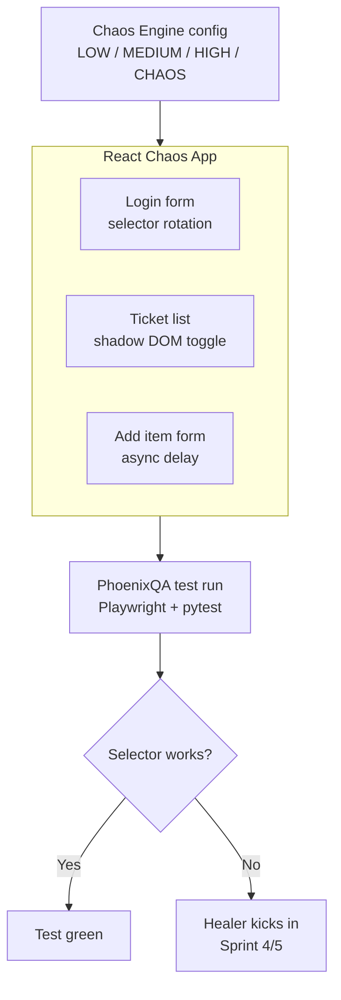

# 🔥 PhoenixQA

> Self-healing test automation framework for fragile frontends.
> When a selector breaks, PhoenixQA doesn't crash — it heals.

[](https://python.org)
[](https://playwright.dev)
[](https://ollama.ai)
[](LICENSE)

---

## 🧠 What is this?

Frontend tests break constantly — not because the feature is broken, but because a selector changed.
A class was renamed. A `data-testid` moved. A Shadow DOM appeared. An iframe wrapped a component.

**PhoenixQA** intercepts those failures, feeds the context to an LLM, and either:
- proposes a fix for human review (**Safe Mode**)
- applies the fix automatically and continues (**Autonomous Mode**)

Every decision is logged. Every logged decision improves future healing (**Self-Training Loop**).

---

## 🏗️ Architecture

```
Test Failure
    │
    ▼
Context Collector        ← DOM snapshot, screenshot, console logs, network
    │
    ▼
LLM Analyzer             ← Ollama (local) or Anthropic API
    │
    ├──► Safe Mode        ← Human reviews, accepts/rejects → Ground Truth
    │
    └──► Autonomous Mode  ← Auto-applies fix, re-runs test
              │
              ▼
        Healing History   ← SQLite log of all decisions
              │
              ▼
        Self-Training     ← Few-shot context for better future repairs
```

---

## 🗂️ Project Structure

```
PhoenixQA/
├── chaos_app/              # React/Vite — intentionally unstable test target
├── phoenix/
│   ├── collector/          # Context gathering on failure
│   ├── healing/            # Safe Mode + Autonomous Mode orchestration
│   ├── ai/                 # LLM provider abstraction (Ollama / Anthropic)
│   ├── training/           # Healing history + self-training loop
│   └── reporting/          # Allure Phoenix Healing Report
├── pages/                  # Page Objects for Chaos App (POM pattern)
├── tests/
│   ├── chaos/              # Tests running against Chaos App
│   ├── unit/
│   └── integration/
└── config/
```

---

## 🔒 Privacy-first AI design

| Provider    | When to use                                      |
|-------------|--------------------------------------------------|
| `ollama`    | Air-gapped / NDA environments, local LLM         |
| `anthropic` | Cloud projects, best quality healing suggestions |

Switch via single env variable. No code changes.

---

## 🗺️ Roadmap

| Sprint   | Focus                                                         | Status     |
|----------|---------------------------------------------------------------|------------|
| Sprint 0 | Repo scaffold, config, AI provider stubs                      | ✅ Done     |
| Sprint 1 | Chaos App — React/Vite with configurable DOM instability      | ⏳ Planned  |
| Sprint 2 | Context Collector — DOM snapshot, screenshot, logs            | ⏳ Planned  |
| Sprint 3 | LLM Analyzer — prompt engineering, structured JSON response   | ⏳ Planned  |
| Sprint 4 | Safe Mode — Human-in-the-loop, ground truth builder           | ⏳ Planned  |
| Sprint 5 | Autonomous Mode — auto-apply, pytest re-run loop              | ⏳ Planned  |
| Sprint 6 | Healing History — SQLite store, decision log                  | ⏳ Planned  |
| Sprint 7 | Self-Training Loop — few-shot builder, Safe vs Auto metrics   | ⏳ Planned  |
| Sprint 8 | Allure Phoenix Report, CI/CD, demo GIF                        | ⏳ Planned  |

---

## 🚀 Quickstart

```bash
# 1. Clone
git clone https://github.com/MarcinMikula/PhoenixQA.git
cd PhoenixQA

# 2. Install
pip install -r requirements.txt
playwright install chromium

# 3. Configure
cp .env.example .env
# Edit .env — choose AI provider

# 4. Run (coming Sprint 1+)
python -m phoenix
```

---

## 🤝 Part of the QA Ecosystem

PhoenixQA is one piece of a larger AI-powered QA toolkit:

| Repo | Role |
|------|------|
| [qa-automation-framework](https://github.com/MarcinMikula/qa-automation-framework) | POM/SOM skeleton — PhoenixQA heals its selectors |
| [defect-pilot](https://github.com/MarcinMikula/defect-pilot) | AI bug reproduction & retest agent |
| [llm-qa-toolkit](https://github.com/MarcinMikula/llm-qa-toolkit) | LLM-as-judge test framework for AI chatbots |

---

## 📄 License

MIT
